# Zoldify — Tập sơ đồ kiến trúc

**Ngày:** 06/08/2026
**Đi kèm:** [`2026-08-06-zoldify-scale-mobile-design.md`](./2026-08-06-zoldify-scale-mobile-design.md)

> Sơ đồ ở đây **minh hoạ** các quyết định đã lập luận trong design doc, không thay thế nó. Đọc design doc trước để biết *vì sao*; đọc file này để thấy *hình dạng*.

**Nhãn trong sơ đồ viết bằng tiếng Anh, chữ giải thích quanh sơ đồ để tiếng Việt.**
Báo cáo phải toàn tiếng Anh nên nhãn dịch sẵn; phần chữ là để nhóm đọc, không đi vào
báo cáo. Cùng quy ước với `2026-08-08-activity-class-diagrams.md`.

Toàn bộ viết bằng Mermaid — render trực tiếp trên GitHub, GitLab và VS Code (extension *Markdown Preview Mermaid Support*). Sửa được bằng text nên **diff review được trong Pull Request**, khác với ảnh PNG hay file draw.io.

Xuất ảnh và file nguồn:

```bash
npm run diagrams:export     # SVG + PNG 2x + .mmd cho từng sơ đồ
```

Báo cáo yêu cầu sơ đồ vẽ bằng **draw.io**. File `.mmd` sinh ra là để dán vào
draw.io theo đường **+ (Insert) → Advanced → Mermaid…**, nó dựng lại thành hình khối
sửa được.

---

## Mục lục

**Kiến trúc**
1. [C4 mức 1 — Bối cảnh hệ thống](#1-c4-mức-1--bối-cảnh-hệ-thống)
2. [C4 mức 2 — Container](#2-c4-mức-2--container)
3. [C4 mức 3 — Bounded context & luật phụ thuộc](#3-c4-mức-3--bounded-context--luật-phụ-thuộc)
4. [Sơ đồ triển khai](#4-sơ-đồ-triển-khai)

**Dữ liệu**

5. [ERD — lõi tiền](#5-erd--lõi-tiền)
6. [ERD — catalog & đơn hàng](#6-erd--catalog--đơn-hàng)
7. [Sơ đồ dòng tiền (T-account)](#7-sơ-đồ-dòng-tiền-t-account)

**Hành vi**

8. [Sequence — Đặt hàng, thanh toán, ký quỹ](#8-sequence--đặt-hàng-thanh-toán-ký-quỹ)
9. [Sequence — Webhook PayOS chống lặp](#9-sequence--webhook-payos-chống-lặp)
10. [Sequence — Giải ngân escrow](#10-sequence--giải-ngân-escrow)
11. [Sequence — Refresh token single-flight](#11-sequence--refresh-token-single-flight)
12. [State — Vòng đời đơn hàng](#12-state--vòng-đời-đơn-hàng)
13. [State — Vòng đời escrow](#13-state--vòng-đời-escrow)

**Cho báo cáo đồ án**

14. [Use case tổng quát](#14-use-case-tổng-quát)
15. [Sơ đồ điều hướng app](#15-sơ-đồ-điều-hướng-app)
16. [Luồng CI/CD](#16-luồng-cicd)

---

## 1. C4 mức 1 — Bối cảnh hệ thống

Zoldify nhìn từ bên ngoài: ai dùng, và nó phụ thuộc dịch vụ nào.

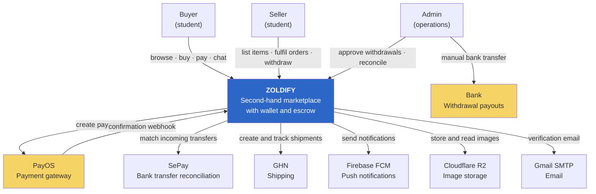

**Điểm cần chú ý:** khâu chi trả rút tiền hiện là **thủ công** — admin tự chuyển khoản rồi đánh dấu hoàn tất. Đây là thiết kế có chủ đích ở quy mô này (API chi hộ của ngân hàng cần pháp nhân và thẩm định), nhưng ledger phải mô hình hoá đúng nó bằng hai bước: `duyệt` rồi mới `đã chuyển khoản`. Xem sơ đồ 7.

---

## 2. C4 mức 2 — Container

Bên trong Zoldify có những tiến trình nào, chạy ở đâu, nói chuyện với nhau ra sao.

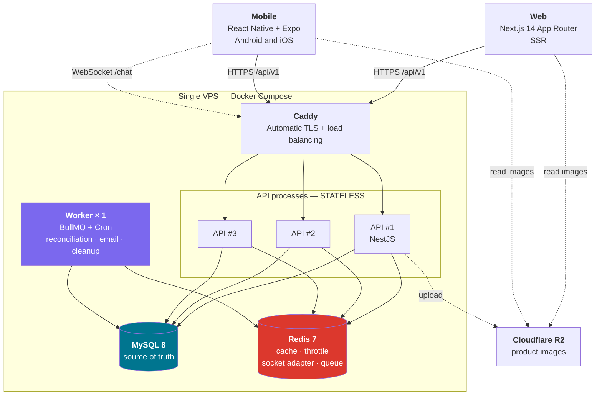

**Ba điều sơ đồ này nói ra:**

- **API không giữ trạng thái** → nhân bao nhiêu bản cũng được. Mọi thứ từng nằm trong RAM tiến trình (cache, bộ đếm rate limit, danh sách socket) đã dời vào Redis.
- **Worker chỉ có đúng 1 bản.** Cron nằm trong API thì 3 tiến trình sẽ chạy job đối soát 3 lần — với job đụng tiền, đó là lỗi nghiêm trọng.
- **Ảnh không nằm trên đĩa VPS.** Đó là điều kiện tiên quyết để nhân bản API, và cũng để redeploy không mất dữ liệu.

---

## 3. C4 mức 3 — Bounded context & luật phụ thuộc

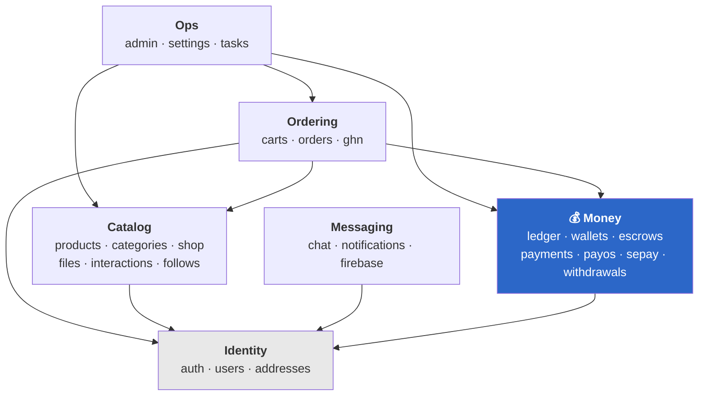

Đọc sơ đồ: mũi tên đi **xuống dưới**. `Identity` là nền, không phụ thuộc ai. `Money` chỉ phụ thuộc `Identity`.

### Vì sao Money KHÔNG trỏ tới Ordering

Đây là quyết định quan trọng nhất của sơ đồ này. `EscrowsService` hiện tại đang `inject Repository<Order>` để tự đi đọc đơn hàng và tự tính tiền cho từng người bán.

Trong thiết kế mới, chiều phụ thuộc **đảo lại**: `Ordering` tính xong số tiền rồi *gọi* `Money`, truyền vào số tiền và một tham chiếu (`reference_type='order'`, `reference_id=123`). Với `Money`, tham chiếu đó chỉ là một chuỗi ký tự vô nghĩa — nó không cần biết "đơn hàng" là gì.

Nhờ vậy `Money` trở thành context **tách ra thành service riêng dễ nhất** khi cần (§3.6 của design doc).

### Luật được máy ép tuân thủ

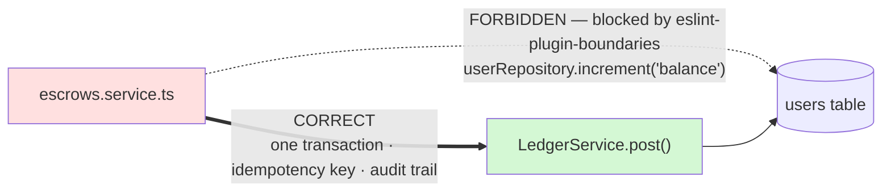

Đường đứt nét màu đỏ chính là dòng `escrows.service.ts:68` đang tồn tại hôm nay — nguồn gốc của việc số dư phân kỳ.

---

## 4. Sơ đồ triển khai

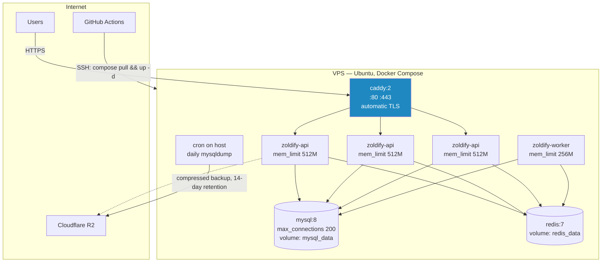

**Tính toán kết nối** — cái bẫy sẽ nổ đúng lúc demo nếu bỏ qua:

| | Hiện tại | Sau khi sửa |
|---|---|---|
| `connectionLimit` mỗi tiến trình | 50 | **15** |
| × 3 API + 1 worker | 200 | 60 |
| `max_connections` của MySQL | 151 *(mặc định)* | **200** |
| Kết quả | 🔴 **Vượt ngưỡng → sập** | 🟢 Còn dư |

---

## 5. ERD — lõi tiền

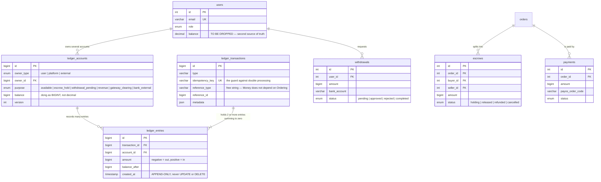

**Ba điều ERD này ép buộc:**

1. `ledger_entries` là **append-only**. Không có cột nào cho phép sửa. Muốn đảo một giao dịch thì ghi giao dịch ngược lại — lịch sử không bao giờ mất.
2. `idempotency_key` là `UNIQUE` ở tầng database, không phải ở tầng code. Code có thể quên kiểm tra; database thì không.
3. `users.balance` bị xoá. Còn tồn tại là còn có người ghi vào.

---

## 6. ERD — catalog & đơn hàng

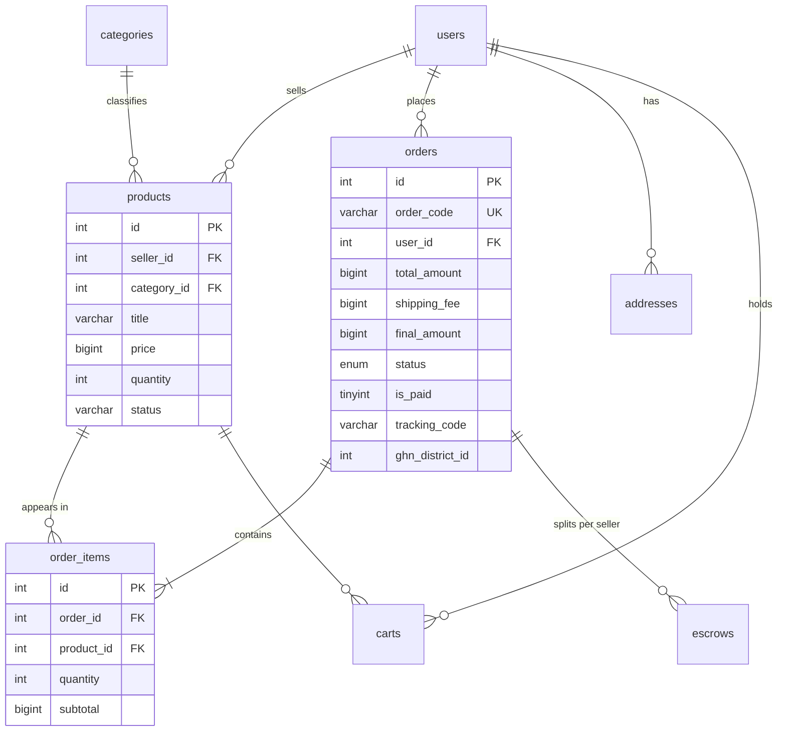

**Vì sao một đơn sinh ra nhiều escrow:** giỏ hàng có thể chứa sản phẩm của nhiều người bán khác nhau. Người mua trả **một lần**, nhưng tiền phải được giữ hộ và giải ngân **riêng cho từng người bán** — người bán A giao xong thì nhận tiền của mình, không phải chờ người bán B.

---

## 7. Sơ đồ dòng tiền (T-account)

Từng đồng đi qua Zoldify di chuyển theo đúng sơ đồ này. Không có đường nào khác.

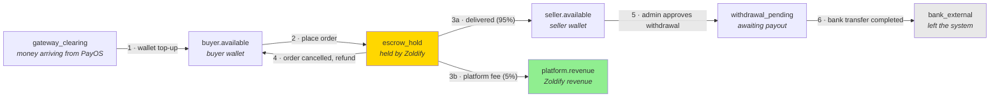

**Ô vàng `escrow_hold` là ô quan trọng nhất trong toàn hệ thống.** Số dư của nó phải luôn khớp với số tiền thật đang nằm trong tài khoản ngân hàng của Zoldify. Đây là câu hỏi đầu tiên mà bất kỳ bên kiểm toán, nhà đầu tư, hay đối tác thanh toán nào cũng sẽ hỏi:

> *"Các bạn đang giữ hộ người dùng bao nhiêu tiền, và chứng minh bằng cách nào?"*

Kiến trúc hiện tại **không trả lời được câu này**. Kiến trúc mới trả lời bằng một câu truy vấn duy nhất.

Lưu ý bước 5 và 6 tách rời: khoảng giữa hai bước là lúc admin đang thao tác chuyển khoản thủ công ở ngân hàng. Tiền đã rời ví người bán nhưng chưa ra khỏi hệ thống — phải có một tài khoản riêng cho trạng thái đó, nếu không sẽ không đối soát được.

---

## 8. Sequence — Đặt hàng, thanh toán, ký quỹ

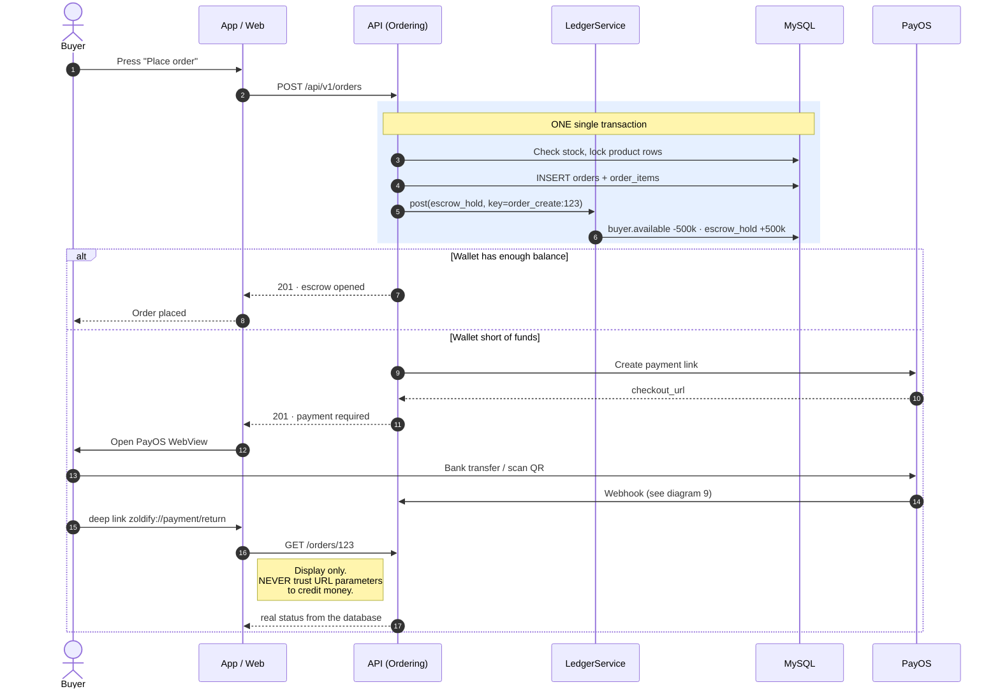

**Bước 9 là chỗ dễ sai nhất khi làm app.** Deep link quay về là do *trình duyệt* gọi, mà URL thì người dùng sửa được. Nếu app tin vào tham số trên URL để coi như đã thanh toán, ai cũng có thể tự "thanh toán" bằng cách gõ tay một địa chỉ. Deep link **chỉ được phép điều hướng giao diện**; nguồn sự thật duy nhất là webhook đi thẳng từ PayOS vào backend.

---

## 9. Sequence — Webhook PayOS chống lặp

Đây là sơ đồ vá lỗi **L4** trong design doc.

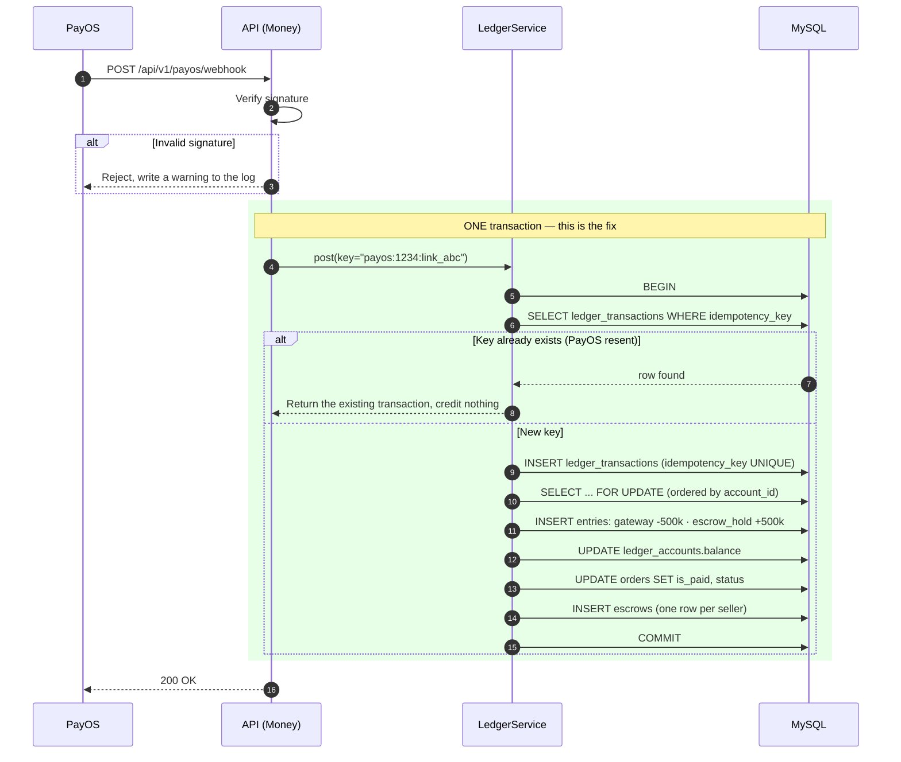

### So sánh trước và sau

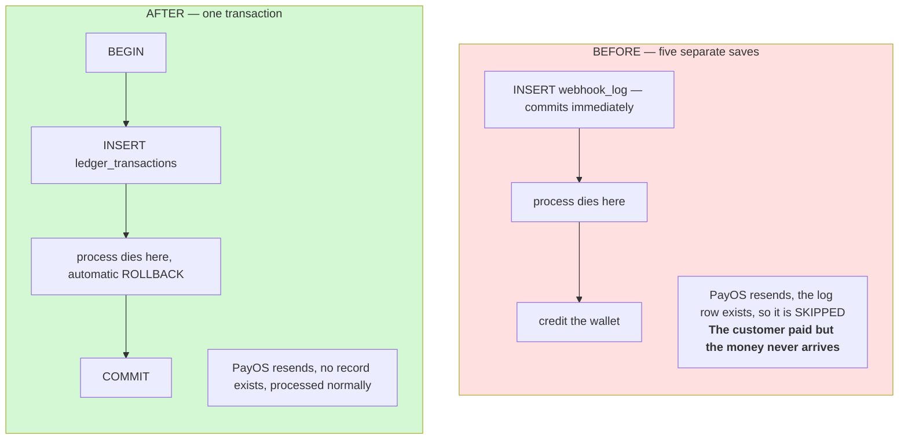

Điểm mấu chốt: bản ghi chống lặp và việc cộng tiền phải **chung một số phận**. Hoặc cả hai cùng tồn tại, hoặc cả hai cùng không. Ở giữa là chỗ tiền biến mất.

---

## 10. Sequence — Giải ngân escrow

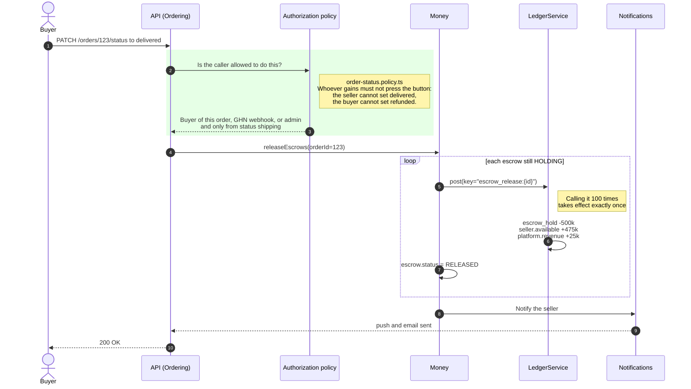

Sơ đồ này gom **hai lỗ hổng** vào một hình:

- **Ô đỏ** — thiếu kiểm tra phân quyền. Đây là card *"tiền kẹt trong escrow"* đã có sẵn trên board: `PATCH /orders/:id/status` không kiểm vai trò, nên bất kỳ ai xem được đơn cũng có thể đặt trạng thái `delivered` và tự giải ngân tiền về ví mình.
- **Vòng lặp** — hiện tại đọc rồi ghi mà không khoá, hai request đồng thời sẽ giải ngân hai lần. Khoá idempotency giết luôn khả năng này.

---

## 11. Sequence — Refresh token single-flight

Không có phần này thì app đăng xuất người dùng mỗi 15 phút.

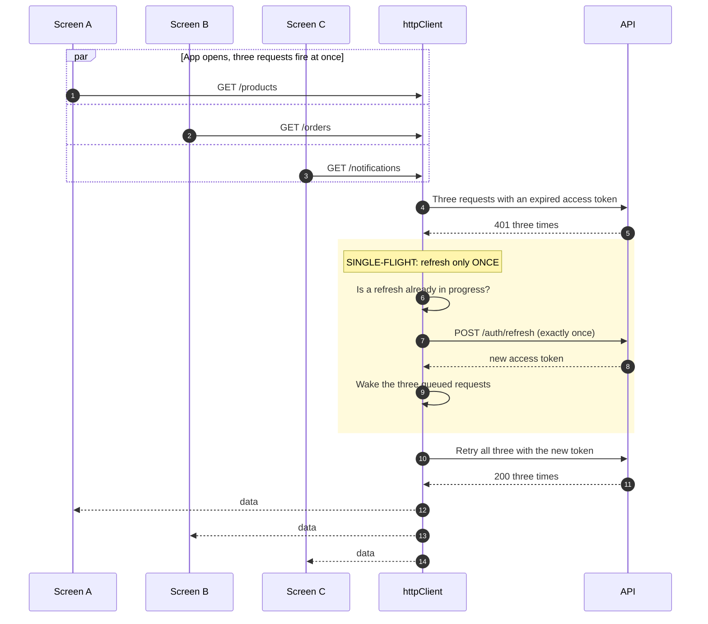

Không có single-flight thì 3 request sẽ gọi 3 lần refresh. Backend có `token_version` nên lần refresh sau **vô hiệu hoá** token của lần trước — kết quả là người dùng bị đăng xuất đúng vào lúc mở app. Triệu chứng rất khó lần ra vì nó chỉ xảy ra khi nhiều request đồng thời.

---

## 12. State — Vòng đời đơn hàng

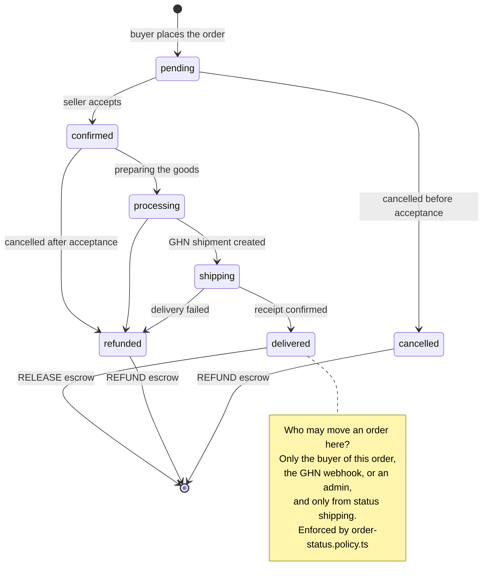

**Mỗi mũi tên dẫn tới `[*]` đều làm tiền chuyển động.** Đó là lý do phân quyền trên chuyển trạng thái là vấn đề bảo mật tài chính, không phải chuyện UX.

---

## 13. State — Vòng đời escrow

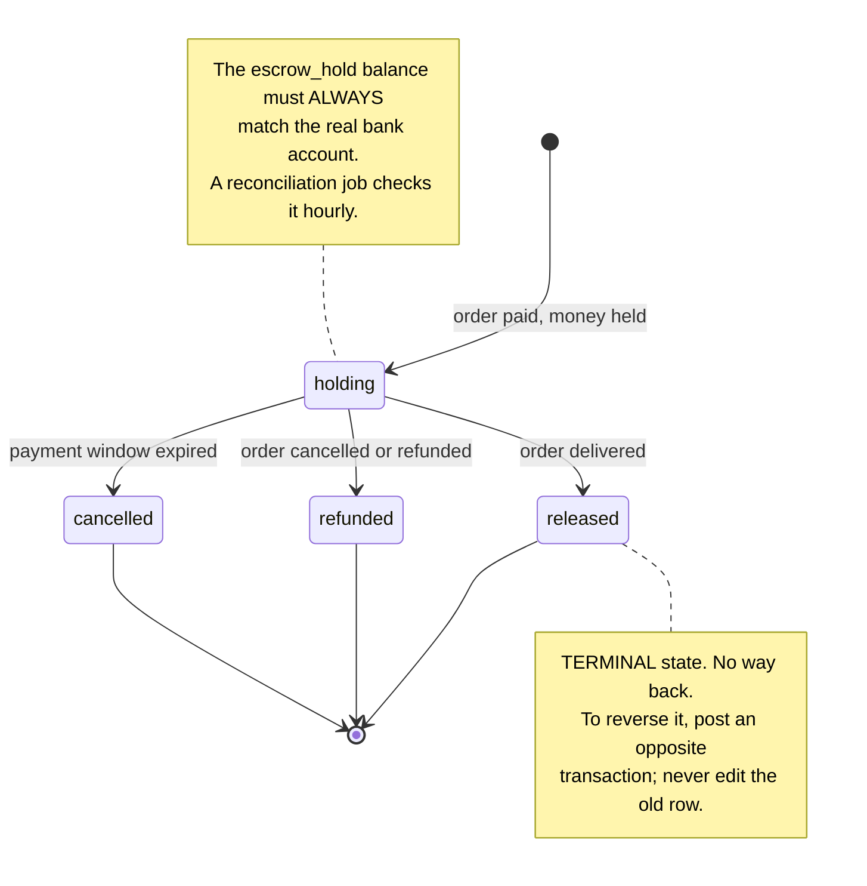

---

## 14. Use case tổng quát

Dành cho báo cáo đồ án.

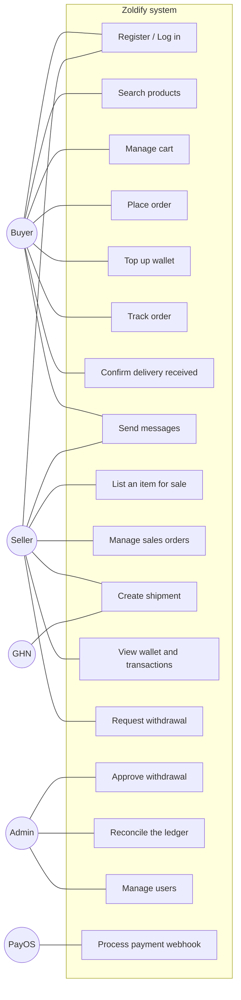

---

## 15. Sơ đồ điều hướng app

28 màn, nhóm theo Expo Router.

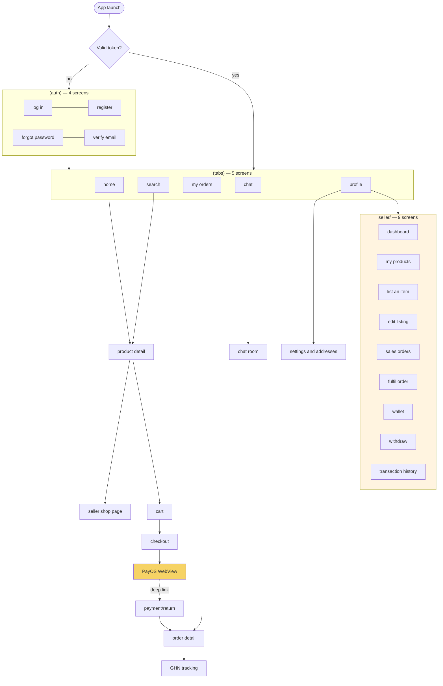

Khối màu cam là phần người bán — **đúng một nửa khối lượng công việc của app**, khớp với cảnh báo lúc chốt scope.

---

## 16. Luồng CI/CD

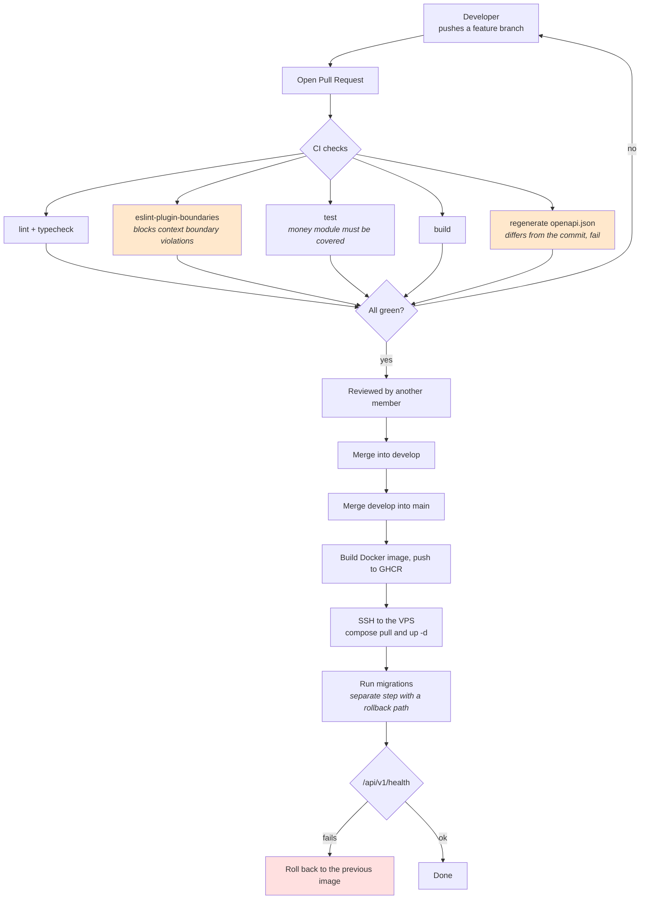

Hai ô cam là hai cổng kiểm tra tự động đặc thù của kiến trúc này:

- **`eslint-plugin-boundaries`** biến luật ranh giới context từ một thoả thuận miệng thành một điều kiện chặn merge. Không có nó, luật sẽ bị phá trong vòng hai tuần.
- **Kiểm `openapi.json`** đảm bảo web và mobile không bao giờ code dựa trên một hợp đồng đã lỗi thời.

---

## Phụ lục — Sơ đồ nào cần cho báo cáo đồ án

| Sơ đồ | Chương báo cáo | Bắt buộc |
|---|---|---|
| 14 · Use case | Phân tích yêu cầu | ✅ |
| 5, 6 · ERD | Thiết kế cơ sở dữ liệu | ✅ |
| 8, 9, 10 · Sequence | Thiết kế chi tiết | ✅ |
| 12, 13 · State | Thiết kế chi tiết | ✅ |
| 1, 2, 3 · C4 | Kiến trúc hệ thống | ✅ |
| 4 · Triển khai | Cài đặt & triển khai | ✅ |
| 7 · Dòng tiền | Nghiệp vụ cốt lõi | ⭐ điểm nhấn |
| 15 · Điều hướng app | Thiết kế giao diện | nên có |
| 16 · CI/CD | Quy trình phát triển | nên có |

Sơ đồ 7 là thứ đáng đưa lên đầu khi bảo vệ: hầu như không đồ án nào ở mức này mô hình hoá dòng tiền tử tế, và nó chứng minh nhóm hiểu bài toán chứ không chỉ ghép API.
