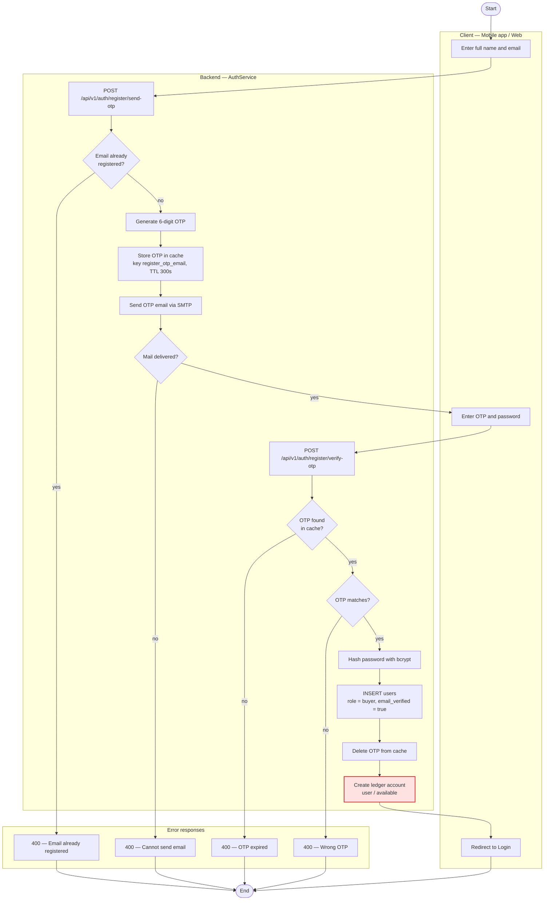
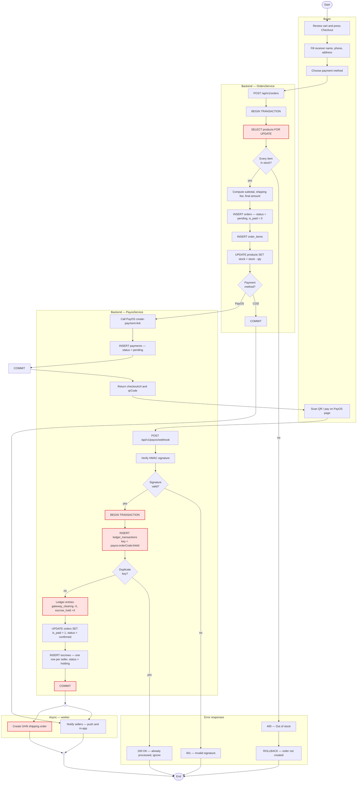
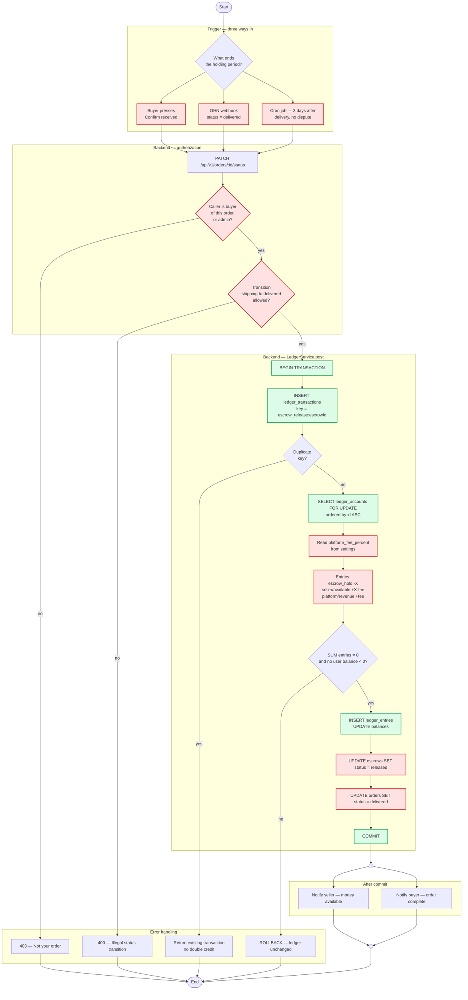
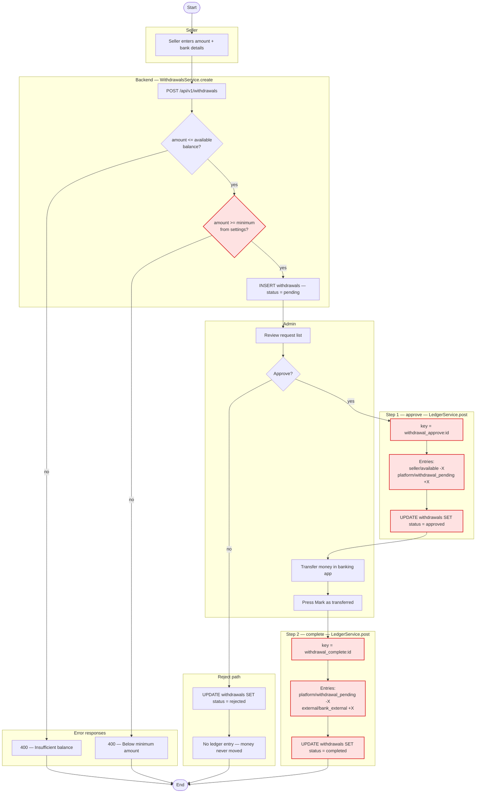
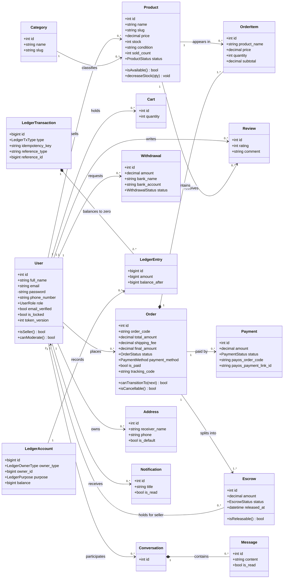
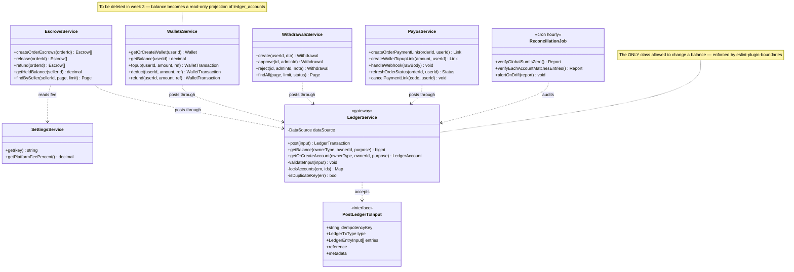
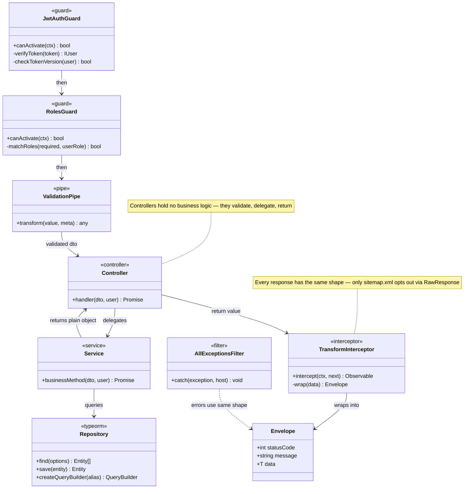

# Zoldify — Activity Diagram & Class Diagram

> Bổ sung sơ đồ **#17** và **#18** trong bảng kiểm kê ở
> `2026-08-06-capstone-delivery-plan.md` §6. Hai sơ đồ này bắt buộc có trong báo cáo
> và là hai sơ đồ duy nhất còn thiếu.
>
> **Nhãn trong sơ đồ viết bằng tiếng Anh ngay từ đầu.** Báo cáo phải toàn tiếng Anh,
> nên dịch lại sau là làm hai lần. Phần chữ giải thích quanh sơ đồ để tiếng Việt cho
> nhóm đọc — chữ đó không đi vào báo cáo, chỉ sơ đồ mới đi.

---

## Mục lục

| Mã | Sơ đồ | Dùng ở đâu |
|---|---|---|
| [AD-01](#ad-01--registration-with-email-otp) | Activity — Đăng ký có OTP | Ch. **II** Analyze System Requirements |
| [AD-02](#ad-02--place-order-and-pay) | Activity — Đặt hàng và thanh toán | Ch. **II** · slide 10 |
| [AD-03](#ad-03--escrow-release) | Activity — Giải ngân ký quỹ | Ch. **II** · slide 13 |
| [AD-04](#ad-04--seller-withdrawal-two-step) | Activity — Rút tiền 2 bước | Ch. **II** |
| [CD-01](#cd-01--domain-model) | Class — Mô hình miền | Ch. **III** Design Details |
| [CD-02](#cd-02--money-service-layer) | Class — Tầng dịch vụ tiền | Ch. **III** · dùng khi phản biện |
| [CD-03](#cd-03--request-pipeline) | Class — Đường đi một request | Ch. **III** |

Mẫu báo cáo đòi Activity Diagram ở **chương II** (đi kèm bảng đặc tả use case) và
Class Diagram ở **chương III** (đi kèm Sequence + ERD) — xem §4 của
`2026-08-06-capstone-delivery-plan.md`. Đặt nhầm chương là mất điểm hình thức mà
không ai nhắc.

---

## Quy ước đọc: TO-BE, không phải AS-IS

Sơ đồ dưới đây vẽ **hệ thống sẽ bảo vệ**, không phải hệ thống đang chạy hôm nay.
Chỗ nào chưa có trong mã nguồn, tôi đánh dấu 🔴 ngay trong sơ đồ và liệt kê ở bảng
"Còn thiếu" ngay dưới mỗi sơ đồ.

Làm vậy vì hai lý do. Thứ nhất, báo cáo mô tả sản phẩm cuối. Thứ hai — quan trọng hơn
với nhóm lúc này — **mỗi ô 🔴 chính là một task**. Đây là nguồn để chia việc, không
phải hình vẽ trang trí.

---

## AD-01 — Registration with email OTP

Nguồn: `identity/auth/auth.service.ts:60-119`, `identity/users/users.service.ts`.



**Còn thiếu (🔴 = ô tô đỏ)**

| Ô | Việc phải làm | Ai | Chi phí |
|---|---|---|---|
| `A9` | Tạo sẵn `ledger_accounts` cho user mới ngay khi đăng ký, thay vì tạo lười lúc giao dịch đầu | A | 1 giờ |

**Điểm đáng nói khi bảo vệ.** OTP nằm trong cache có TTL chứ không nằm trong bảng
`users`. Nghĩa là tài khoản **chỉ được tạo sau khi xác thực xong** — không có hàng
đống tài khoản rác `email_verified = false` nằm chiếm chỗ email của người khác. Đổi
lại, cache mất thì người dùng phải xin OTP lại; với 5 phút thì đó là đánh đổi đúng.

---

## AD-02 — Place order and pay

Nguồn: `ordering/orders/orders.service.ts:51-169`, `money/payos/payos.service.ts:45-109, 315+`.

Đây là sơ đồ dày nhất và cũng là sơ đồ hay bị hỏi nhất, vì nó là chỗ tiền đổi chủ.



**Còn thiếu (🔴)**

| Ô | Việc phải làm | Ai | Chi phí |
|---|---|---|---|
| `O3` | `SELECT ... FOR UPDATE` khi trừ kho. Hiện đọc rồi ghi không khoá → hai người mua món cuối cùng cùng lúc thì kho về âm | A | 3 giờ |
| `W3`,`W8` | Gói webhook vào **một** transaction. Hiện log chống lặp ghi **trước** và **ngoài** transaction: sập giữa chừng là tiền vào mà đơn không đổi trạng thái | A | 1 ngày |
| `W4` | Dùng `ledger_transactions.idempotency_key` thay cho bảng `payos_webhook_log` | A | trong cùng task |
| `W5` | Ghi bút toán kép thay vì `users.balance += X` | A | trong cùng task |
| `N2` | Tạo vận đơn GHN tự động sau khi trả tiền | B | 0,5 ngày |

**Vì sao có hai nhánh COMMIT.** Với COD, đơn chốt xong là hết. Với PayOS thì phải
tạo được link thanh toán **trước khi** commit — nếu PayOS trả lỗi mà đơn đã commit,
người dùng có đơn treo không có đường trả tiền. Trừ kho và tạo link nằm chung một
transaction, hỏng một cái là hỏng cả hai.

**Vì sao webhook là nguồn sự thật, không phải deep link.** Người dùng trả tiền xong
có thể tắt trình duyệt trước khi bị chuyển về app. Deep link `zoldify://payment/return`
chỉ để điều hướng cho đẹp; cái quyết định "đã trả tiền" là webhook PayOS gọi thẳng
vào backend. Thầy hay hỏi chỗ này.

---

## AD-03 — Escrow release

Nguồn: `money/escrows/escrows.service.ts:55-76`, `ordering/orders/orders.service.ts:238-326`.

Đây là sơ đồ có nhiều ô đỏ nhất, và đó chính là vấn đề: **hôm nay tiền vào escrow
rồi không có đường ra hợp lệ.**



**Đã có (🟢)** — `L1`, `L2`, `L3`, `L6`, `L9` chính là `LedgerService.post()` đã viết
xong và có 6 test chạy trên MySQL thật.

**Còn thiếu (🔴)**

| Ô | Việc phải làm | Ai | Chi phí |
|---|---|---|---|
| `G2` | **Lỗ hổng bảo mật.** `PATCH /orders/:id/status` không kiểm vai trò. Ai xem được đơn cũng đặt được `delivered`, tức tự nhả tiền cho chính mình | A | 2 giờ · **làm trước tiên** |
| `G3` | Bảng chuyển trạng thái hợp lệ. Hiện nhảy từ `pending` thẳng sang `delivered` được | A | 2 giờ |
| `T2` | Nút "Đã nhận hàng" ở app + web. Grep toàn bộ frontend: **không nơi nào** gửi `status = delivered`, chỉ có một nhãn tab lọc | B (web) · C (app) | 0,5 ngày |
| `T3` | Webhook GHN | B | 0,5 ngày |
| `T4` | Cron tự giải ngân sau 3 ngày | A | 0,5 ngày |
| `L4`,`L5` | Phí sàn đọc từ `settings`, chia 3 chân thay vì 2 | A | 0,5 ngày |
| `L7`,`L8` | Cập nhật escrow + order **trong cùng** transaction ledger | A | trong cùng task |

**Câu hỏi phản biện gần như chắc chắn bị hỏi:** *"Nếu người mua không bao giờ bấm xác
nhận thì tiền của người bán kẹt vĩnh viễn à?"* — Trả lời bằng ô `T4`: có cron tự giải
ngân sau 3 ngày kể từ khi GHN báo đã giao, nếu không có khiếu nại. Ba đường vào
`T2`/`T3`/`T4` tồn tại chính là để không có đường cụt.

---

## AD-04 — Seller withdrawal (two-step)

Nguồn: `money/withdrawals/withdrawals.service.ts`.

Hai bước, vì chuyển khoản ngân hàng là thao tác **tay** của admin. Tiền phải rời ví
người bán ngay lúc duyệt (chống rút hai lần), nhưng chỉ rời hệ thống khi admin xác
nhận đã chuyển thật.



**Còn thiếu (🔴)** — toàn bộ phần ledger. Hiện `approve()` chỉ đổi cột `status`, không
đụng tới tiền. Việc của A tuần 4, ~1,5 ngày.

**Vì sao phải có tài khoản `withdrawal_pending` riêng.** Nếu chỉ trừ ví người bán rồi
coi như xong, thì lúc đối soát sẽ thấy tổng ví < tổng tiền thật trong ngân hàng, mà
không giải thích được phần chênh nằm đâu. Tài khoản trung gian này chính là câu trả
lời: *"chỗ chênh là 7 lệnh rút đã duyệt, admin chưa bấm nút chuyển."*

---

## CD-01 — Domain model

Đây là **Class Diagram**, không phải ERD. Khác nhau ở chỗ nào — xem ghi chú cuối mục.



**Vì sao `Order` có `1..*` Escrow chứ không phải `1`.** Một đơn có thể chứa hàng của
nhiều người bán khác nhau. `EscrowsService.createOrderEscrows()` gom `order_items`
theo `seller_id` rồi tạo **một escrow cho mỗi người bán** — xem
`escrows.service.ts:31-52`. Đây là điểm dễ bị hỏi và cũng là chỗ nhiều nhóm làm sai.

**Vì sao `LedgerTransaction` có `2..*` Entry.** Không thể có bút toán một chân. Tiền
phải đi *từ đâu đó* *tới đâu đó*, và tổng phải bằng không. Ràng buộc này được ép ở
`LedgerService.validateInput()` chứ không chỉ vẽ cho đẹp.

**Class Diagram khác ERD chỗ nào** — câu hỏi phản biện kinh điển:

| | ERD (sơ đồ #5, #6) | Class Diagram (sơ đồ này) |
|---|---|---|
| Mô tả | Bảng trong MySQL | Lớp trong mã nguồn TypeScript |
| Thành phần | Cột, kiểu dữ liệu, khoá chính/ngoại | Thuộc tính **và phương thức**, tầm nhìn `+`/`-` |
| Có gì mà bên kia không có | Index, ràng buộc `UNIQUE`, `ON DELETE` | Hành vi (`canTransitionTo`), lớp không có bảng (`LedgerService`) |
| Ví dụ cụ thể | `users.password VARCHAR(255)` | `User.password` để dấu `-` vì `select: false` |

---

## CD-02 — Money service layer

Sơ đồ này là thứ ERD **không thể** biểu diễn: các lớp có hành vi nhưng không có bảng
tương ứng. Nó cũng là chỗ thể hiện luật kiến trúc quan trọng nhất của dự án.



**Luật đọc từ sơ đồ này:** mọi mũi tên tiền đều **đi vào** `LedgerService`, không có
mũi tên nào đi ra. Không lớp nào được `UPDATE ledger_accounts.balance` trực tiếp, kể
cả các lớp trong cùng context `money`. Luật đó không nằm trong quy ước miệng — nó
được `eslint-plugin-boundaries` ép, và CI đỏ nếu ai vi phạm.

**`WalletsService` sẽ bị xoá.** Hiện nó là **nguồn sự thật thứ ba** cho số dư, bên
cạnh `users.balance` và `wallets.balance`. Ba nguồn sự thật cho cùng một con số là
lý do dự án phải làm ledger ngay từ đầu.

---

## CD-03 — Request pipeline

Đường đi của một request từ lúc chạm server đến lúc trả về. Sơ đồ này trả lời câu
"kiến trúc backend theo mô hình gì" bằng lớp thật, không bằng chữ.



**Vì sao Controller mỏng.** Ba client (web, Android, iOS) gọi cùng một `Service`.
Nếu logic nằm ở Controller thì mỗi lần thêm một cửa vào — ví dụ một cron job hay một
lệnh CLI — là chép lại logic. Đây cũng là lý do `LedgerService` gọi được từ webhook
PayOS, từ admin panel, và từ cron mà không cần đi qua HTTP.

---

## Cách xuất sơ đồ ra ảnh cho báo cáo

Thông báo capstone cấm chụp màn hình sơ đồ. Dùng script có sẵn:

```bash
npm run diagrams:export      # xuất SVG + PNG ra docs/system-design/exports/
npm run diagrams:check       # chỉ kiểm cú pháp, không ghi ảnh — dùng cho CI
```

Script đọc mọi khối ```` ```mermaid ```` trong `docs/system-design/*.md`, render bằng
`@mermaid-js/mermaid-cli` và ghi ra `docs/system-design/exports/<tên-file>/`.
SVG để chèn vào Word (nét ở mọi cỡ in), PNG 2x cho PowerPoint.

Chạy được script cũng có nghĩa **mọi sơ đồ trong repo hợp lệ về cú pháp** — khối nào
sai thì script in ra số dòng và trả mã thoát khác 0. Lần chạy gần nhất: **25 sơ đồ,
0 lỗi**.

Script cần Chrome. Nó tự dò các đường dẫn quen thuộc trên Windows/macOS/Linux; máy
nào để chỗ khác thì đặt `PUPPETEER_EXECUTABLE_PATH`.

> **Chưa nối vào CI.** Backend hiện chưa có `.github/workflows` nào. Khi B dựng CI
> ở tuần 3 thì thêm `npm run diagrams:check` vào job lint — lúc đó mới thật sự không
> ai merge được sơ đồ hỏng.
