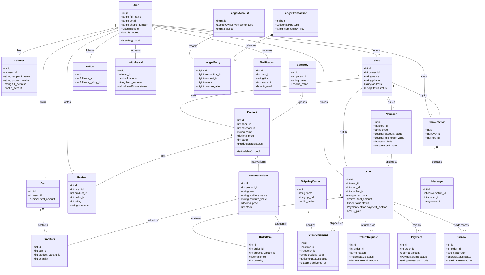

# Biểu đồ Lớp (Class Diagram) - Đã bổ sung

Bản vẽ này bao gồm 20 class cũ và 5 class nâng cao mới: `ProductVariant`, `Voucher`, `ReturnRequest`, `ShippingCarrier`, `Cart`.
Bạn hãy copy phần code bên dưới và paste vào Draw.io (Insert -> Advanced -> Mermaid). 
Draw.io sẽ tự động sắp xếp thông minh: các class trung tâm (như Order, Product, User) sẽ nằm ở giữa, các class ít kết nối hơn sẽ nằm xung quanh.

