# Updated Sequence Diagrams with Activation Boxes

Copy the code below for each diagram and paste it into the Mermaid editor in Draw.io (Double click the diagram -> Paste -> Apply).

## 1. Login
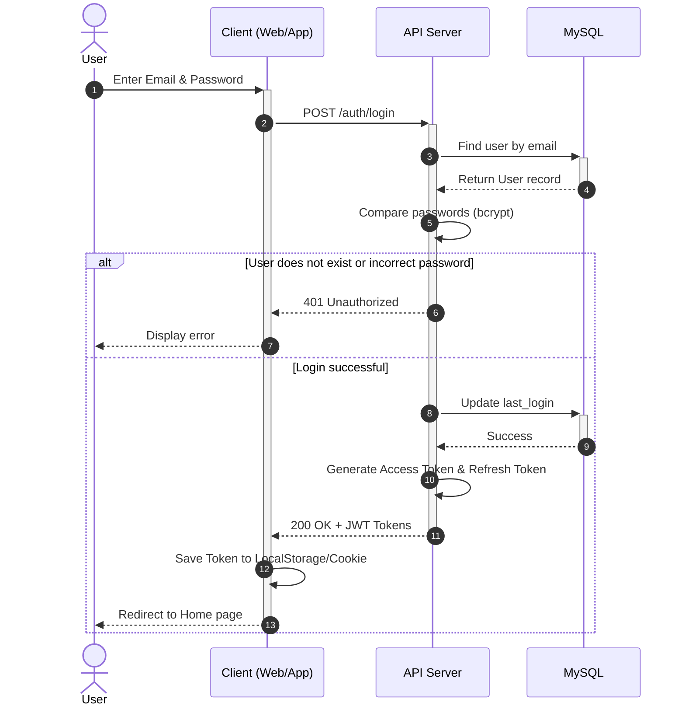

## 2. Cart
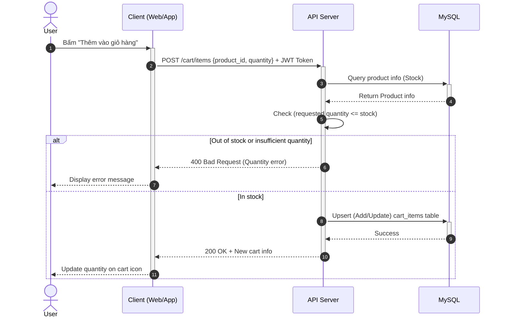

## 3. Chat
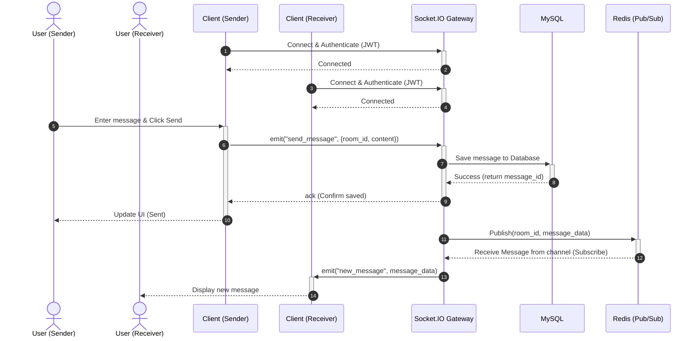

## 4. Checkout
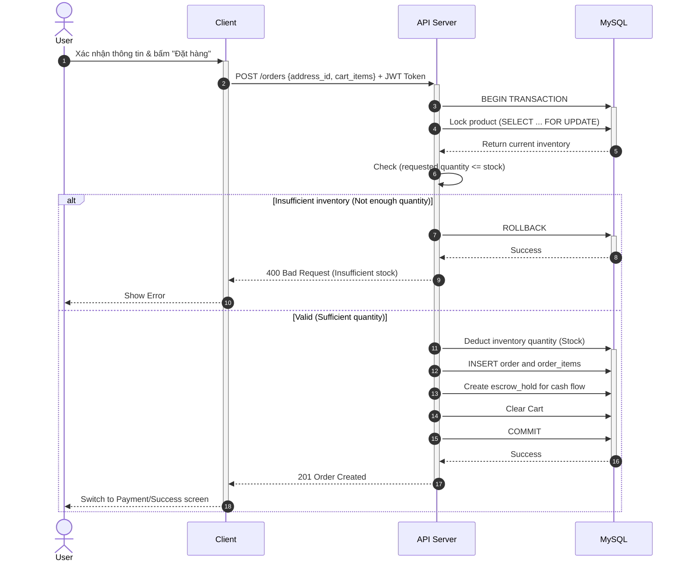

## 5. Google OAuth
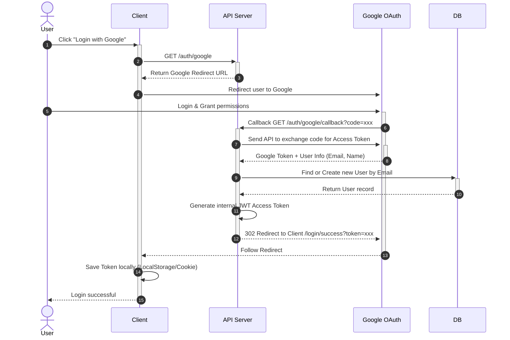

## 6. Password Reset
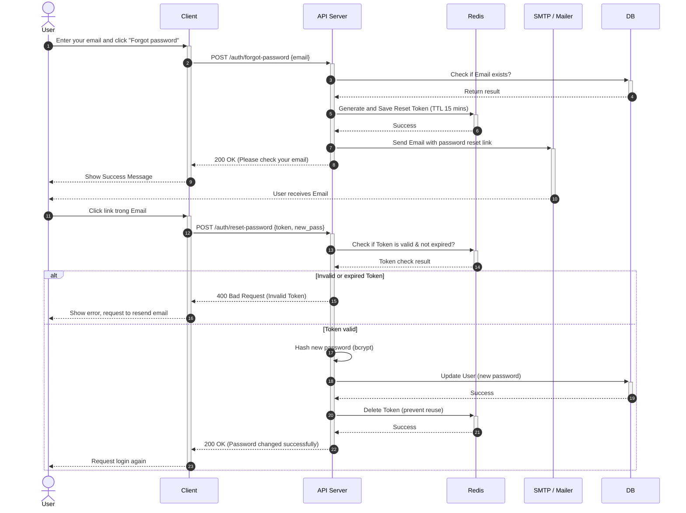

## 7. Payment
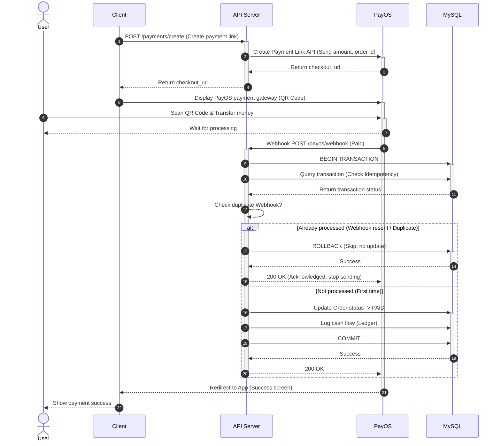

## 8. Product Create
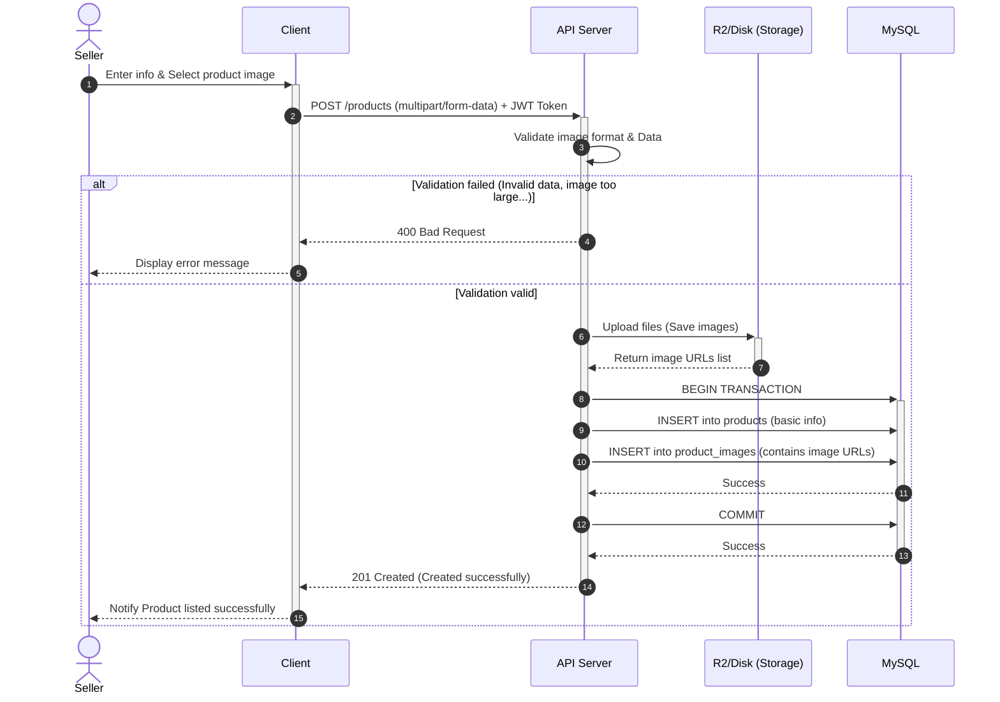

## 9. Product Search
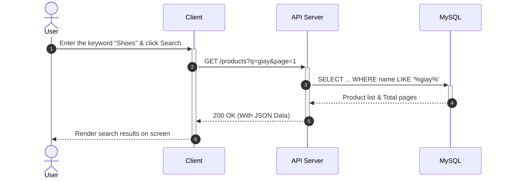

## 10. Product Search (with Redis)
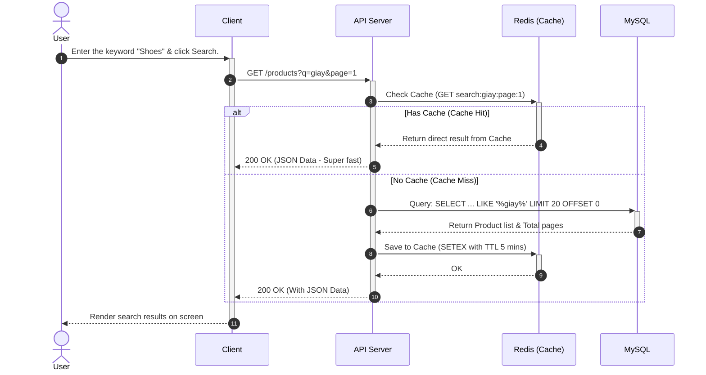

## 11. Profile Update
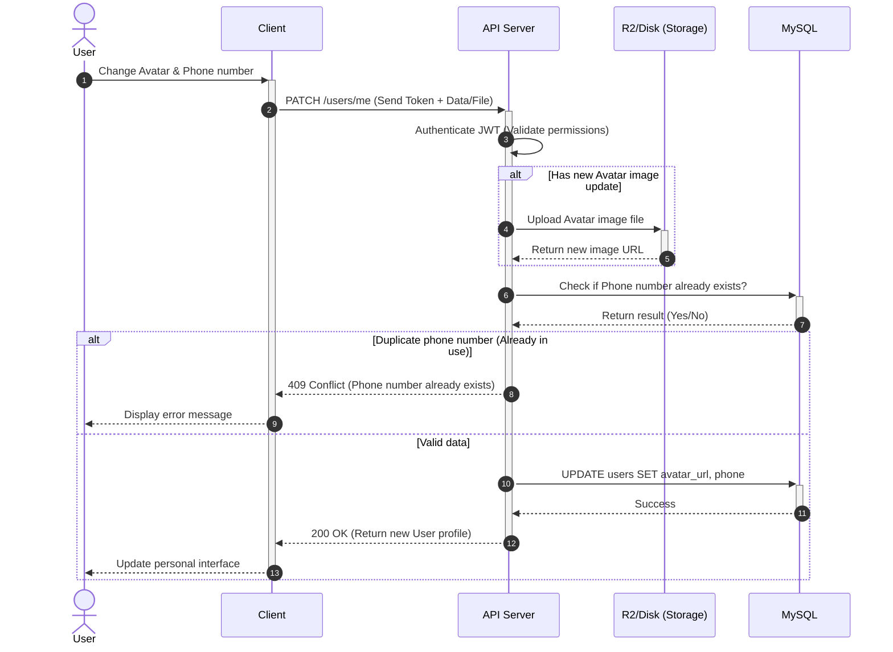

## 12. Registration
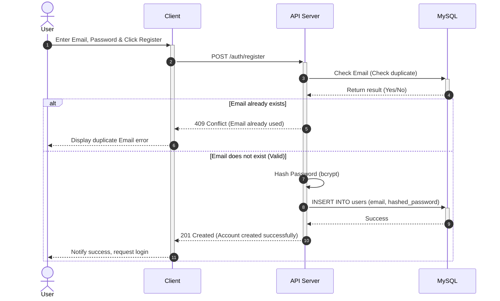

## 13. Shop
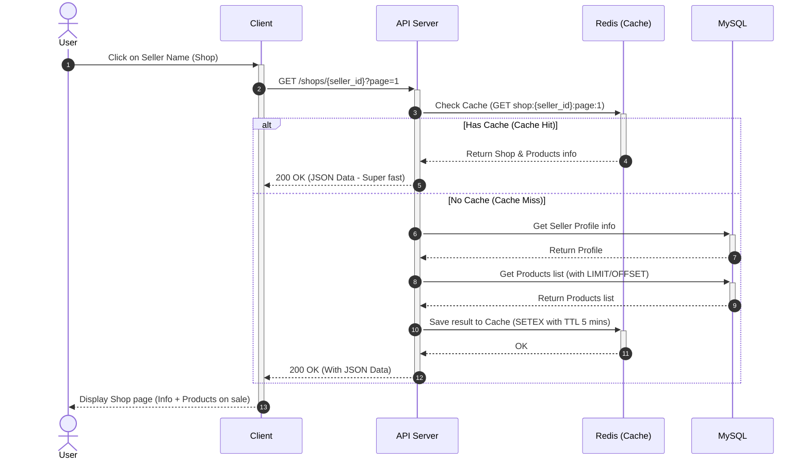

## 14. Email Verification
```mermaid
sequenceDiagram
    autonumber
    actor U as User
    participant C as Client
    participant API as API Server
    participant RD as Redis
    participant SMTP as SMTP / Mailer
    participant DB as DB

    %% Phase 1: Send OTP
    C->>+API: POST /auth/send-verification (Request code)
    API->>+RD: Generate OTP (Save to Redis with TTL 5 mins)
    RD-->>-API: Success
    API->>+SMTP: Send Email with OTP
    SMTP-->>-API: Success
    
    %% Return to Client to open OTP input UI
    API-->>-C: 200 OK (Email sent)
    SMTP-->>-U: User receives Email with OTP
    
    %% Phase 2: Verify OTP
    U->>+C: Enter OTP into App
    C->>+API: POST /auth/verify-email {otp}
    
    API->>+RD: Get OTP from Redis to check
    RD-->>-API: Return result (Valid / Empty)
    
    alt OTP incorrect or expired
        API-->>C: 400 Bad Request (Invalid verification code)
        C-->>U: Display error message
    else OTP correct
        API->>+DB: UPDATE users SET is_verified = TRUE
        DB-->>-API: Success
        API->>+RD: Delete OTP (Prevent reuse)
        RD-->>-API: Success
        API-->>-C: 200 OK (Verification successful)
        C-->>-U: Notify Verification success & Change status
    end
```
